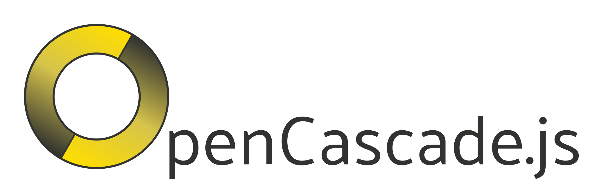

<p align="center">
  

  <h3 align="center">OpenCascade.js</h3>

  <p align="center">
    A port of the <a href="https://www.opencascade.com/">OpenCascade</a> CAD library to JavaScript and WebAssembly via Emscripten.
    <br />
    <a href="./doc/README.md"><strong>Explore the docs »</strong></a>
    <br />
    <br />
    <a href="https://github.com/donalffons/opencascade.js-examples">Examples</a>
    ·
    <a href="https://github.com/donalffons/opencascade.js/issues">Issues</a>
    ·
    <a href="https://github.com/donalffons/opencascade.js/discussions">Discuss</a>
  </p>
</p>

# Projects & Examples:

* [CascadeStudio](https://github.com/zalo/CascadeStudio) is a SCAD (Scripted-Computer-Aided-Design) editor, which runs in the browser.
* [OpenCascade.js-examples](https://github.com/donalffons/opencascade.js-examples) contains general examples on how to use the library.

# Getting Started

(These instructions are for the upcoming `@beta` release. All information is likely to change. See [here](https://github.com/donalffons/opencascade.js/tree/v1.1.1) for instructions of the `v1.1.1` release.)

1. Add the library as a dependency to your project

    ```
    npm install opencascade.js@beta
    ```

2. Configure your bundler to load `.wasm` files as URLs. If you don't want to use a bundler, you can manually pass in the URLs to the WASM files in the next step.

    For webpack, first add the `file-loader` dependency.

    ```
    npm install file-loader --save-dev
    ```
    
    Then add the following configuration to your `webpack.config.js`.

    ``` javascript
    module: {
      rules: [
        {
          test: /\.wasm$/,
          type: "javascript/auto",
          loader: "file-loader"
        }
      ]
    },
    node: {
      fs: "empty"
    }
    ```

3. In your JavaScript file, instantiate the library:

    ```js
    import {
      initOpenCascade,
      ocCore,
      ocModelingAlgorithms,
      ocVisualApplication,
      ocDataExchangeBase,
      ocDataExchangeExtra,
    } from "opencascade.js";

    initOpenCascade({
      libs: [ // Specify which modules to use and the sequence in which to load them
        ocCore,
        ocModelingAlgorithms,
        ocVisualApplication,
        ocDataExchangeBase,
        ocDataExchangeExtra,
      ]
    }).then(oc => {
      // Check out the examples on how to use this library!
    });
    ```

# FAQ

## Is this a fork of the OpenCascade library?

No. This project is making no changes to the OpenCascade library, apart from few very small modifications which are applied as patches. All this project does is
* Download a tagged commit from the [OpenCascade git server](https://git.dev.opencascade.org/gitweb/?p=occt.git;a=summary).
* Compile the OpenCascade library using the Emscripten compiler.
* Analyze the OpenCascade headers using libclang and auto-generate bind-code to expose the library to JavaScript.
* Link the WASM-binaries and provide some convenience functions so that you can easily use the library in your JavaScript projects.

## Who is going to keep this project up-to-date with the OpenCascade library?

This project is (hopefully) keeping itself (mostly) up-to-date with the OpenCascade library, since most bindings are generated automatically.

# Contributing

Contributions are welcome! Feel free to have a look at the [todo-list](TODO.md) if you need some inspiration on what else needs to be done.
