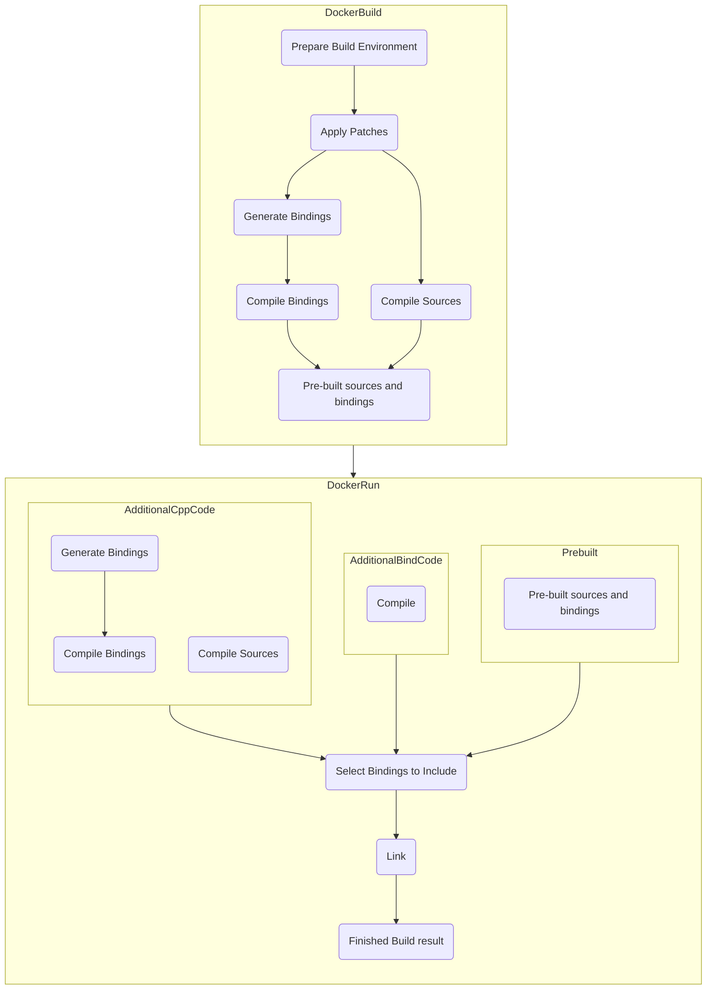

(These instructions are for the upcoming `@beta` release. All information is likely to change. See [here](https://github.com/donalffons/opencascade.js/tree/v1.1.1) for instructions of the `v1.1.1` release.)

# Workflow when building Apps

## 1. Use the pre-built version of the library

As a starting point for your projects, you can use the pre-built version of the library, which is distributed via NPM. This version contains the entirety of the currently supported API surface and is therefore ideal for development, prototyping or applications that require access to the entire OpenCascade.js API.

However, this version comes with the drawback that it includes a lot of code that you might never use in your application. Still, this code has to be downloaded and compiled to each user's system architecture, using up bandwidth, memory and processing power (during instantiation / compilation).

## 2. Create custom builds for production

To solve the previously mentioned issues, this project provides a way to create custom builds. Custom builds allow you to define
* The parts of the OpenCascade library should be included.
* The parts of the API that you are using in your application (called bindings).
* Which compiler settings to use during a build.

# Using Pre-built modules

1. Add the library as a dependency to your project

    ```
    npm install opencascade.js@beta
    ```

2. Configure your bundler to load `.wasm` files as URLs. If you don't want to use a bundler, you can manually pass in the URLs to the WASM files in the next step.

    For webpack, first add the `file-loader` dependency.

    ```
    npm install file-loader --save-dev
    ```
    
    Then add the following configuration to your `webpack.config.js`.

    ``` javascript
    module: {
      rules: [
        {
          test: /\.wasm$/,
          type: "javascript/auto",
          loader: "file-loader"
        }
      ]
    },
    node: {
      fs: "empty"
    }
    ```

3. In your JavaScript file, instantiate the library:

    ```js
    import initOpenCascade from "opencascade.js";

    initOpenCascade().then(oc => {
      // Check out the examples on how to use this library!
    });
    ```

# Creating a custom build

Custom builds are defined using YAML files. One YAML file can contain multiple modules (i.e. multiple builds). 

1. Pull the opencascade.js Docker image from Dockerhub
    ```
    docker pull donalffons/opencascade.js
    ```

2. Create a new file called test.yml with the following content
    ```yml
      mainBuild:
        name: rocketExample.js
        bindings:
          - symbol: STEPCAFControl_Reader
          - symbol: IFSelect_ReturnStatus
          - symbol: TCollection_ExtendedString
          - symbol: TDocStd_Document
          - symbol: Handle_TDocStd_Document
          - symbol: Message_ProgressRange
          - symbol: XCAFDoc_DocumentTool
          - symbol: TDF_LabelSequence
          - symbol: XCAFDoc_ShapeTool
          - symbol: TCollection_AsciiString
          - symbol: RWGltf_CafWriter
          - symbol: BRepTools
          - symbol: BRepMesh_IncrementalMesh
          - symbol: TColStd_IndexedDataMapOfStringString
          - symbol: CDM_Document
          - symbol: Standard_Transient
          - symbol: TDF_Label
          - symbol: TDataStd_GenericEmpty
          - symbol: TDF_Attribute
          - symbol: Handle_XCAFDoc_ShapeTool
          - symbol: NCollection_BaseSequence
          - symbol: TopoDS_Shape
          - symbol: BRepMesh_DiscretRoot
          - symbol: NCollection_BaseMap

          - symbol: CustomClass
        emccFlags:
          - -O3
          - -sEXPORT_ES6=1
          - -sUSE_ES6_IMPORT_META=0
          - -sEXPORTED_RUNTIME_METHODS=['FS']
          - -sINITIAL_MEMORY=100MB
          - -sMAXIMUM_MEMORY=4GB
          - -sALLOW_MEMORY_GROWTH=1
          - -sUSE_FREETYPE=1
      additionalCppCode: |
        #include <iostream>
        class CustomClass {
        public:
          static void SayHello() {
            std::cout << "Hello, World" << std::endl;
          }
        };
    ```

    This will:

    * Create a custom build with the default compiler flags.

    * Generate bindings for the classes defined in the `bindings` property.

    * Add the additional C++ Code from the field `additionalCppCode` into the C++ file, which is used for the build (the code will be placed after all include statements and before the `EMSCRIPTEN_BINDINGS` block). In order for the build system to expose this C++ code to JavaScript, it needs to be class-based (the build system currently cannot handle plain functions) and you must add the class name to the bindings object (in the example above, by specifying `symbol: CustomClass`).

    You can specify custom compilation flags using the `emccFlags` property (as an array) under the `mainBuild` property. See [here](https://github.com/emscripten-core/emscripten/blob/master/src/settings.js) for a complete list of settings. This property is optional and not specifying it will use the default values, used by the official OpenCascade.js build. `-sEXPORT_ES6=1` and `-sUSE_ES6_IMPORT_META=0` produce a ES6 module (as opposed to a UMD module), which should work nicely with most browser-based workflows. `-sEXTRA_EXPORTED_RUNTIME_METHODS=["FS"]` adds support for Emscripten's virtual file system. `-O3` is used to create an optimized build.

    Using `-O3` optimizations, Emscripten is able to perform dead code elimination. This results in very small binary sizes without the need to manually specify which OpenCascade sources to include during the build process.

  3. Run the docker Image against this file. In the directory, in which the yml file is located, run:

      ```
      docker run \
        --rm \
        -it \
        -v $(pwd):/src \
        -u $(id -u):$(id -g) \
        donalffons/opencascade.js \
        test.yml
      ```

      This will produce three files: `rocketExample.js` and `rocketExample.wasm` contain the JavaScript and WebAssembly code. `rocketExample.d.ts` contains Typescript defintions.

  4. Use the custom build in your JavaScript project like this:

      ```js
      import initOpenCascade from "opencascade.js";
      import opencascade from 'rocketExample.js';
      import opencascadeWasm from 'rocketExample.wasm';

      initOpenCascade({
        mainJs: opencascade,
        mainWasm: opencascadeWasm,
      }).then(oc => {
        // Custom build is ready to use!
      });
      ```

# Mapping between C++ and JS APIs

## Overloaded methods

Overloads of C++ functions cannot always be mapped to overloaded JS functions without introducing ambiguities (simply due to differences of C++ and JS). Therefore, the API of this project enumerates all overloads of a function by appending _1, _2, ... to its name by the sequence in which they appear in the declaration.

E.g. if you look into the OpenCascade documentation for [BRepMesh_IncrementalMesh](https://dev.opencascade.org/doc/refman/html/class_b_rep_mesh___incremental_mesh.html), `Perform_1` would give you

```cpp
virtual void Perform (const Message_ProgressRange &theRange=Message_ProgressRange())
```

while `Perform_2` would give you

```cpp
void Perform (const Handle< IMeshTools_Context > &theContext, const Message_ProgressRange &theRange=Message_ProgressRange())
```

## References to built-in data types

While C++ has general support for reference types, JavaScript does not. In JavaScript, when calling a function with arguments, all arguments are passed as (shallow) copies. 

OpenCascade utilizes these reference types quite often as return values, like in this function from the class BRepTools, where `UMin`, `UMax`, `VMin` and `VMax` are all references to a Standard_Real (aka double). When executed, the function mutates the value of those references, thereby "returning" their values.

```cpp
UVBounds(const TopoDS_Face &F, Standard_Real &UMin, Standard_Real &UMax, Standard_Real &VMin, Standard_Real &VMax)
```

In order to use methods with reference types via OpenCascade.js, you have to follow the schema below.

```js
const path = [[-50, 0, 0], [50, 0, 0], [50, 100, 0]].map(([x, y, z]) => new this.oc.gp_Pnt_3(x, y, z));
const makePolygon = new this.oc.BRepBuilderAPI_MakePolygon_3(path[0], path[1], path[2], true);
const wire = makePolygon.Wire();
const makeFace = new this.oc.BRepBuilderAPI_MakeFace_15(wire, false);
const u0 = { current: 0 };
const u1 = { current: 0 };
const v0 = { current: 0 };
const v1 = { current: 0 };
this.oc.BRepTools.UVBounds_1(makeFace.Face(), u0, u1, v0, v1);
console.log({u0, u1, v0, v1});
```

As a side note: You are free to either pass in a "reference type" or a built-in number. The latter doesn't make much sense in this particular example, but is supported (and might make sense for other use cases):

```js
this.oc.BRepTools.UVBounds_1(makeFace.Face(), 123, 234, 345, 456);
```

# Developer Documentation

The following flow-chart gives a broad overview of the steps performed by the build system.


