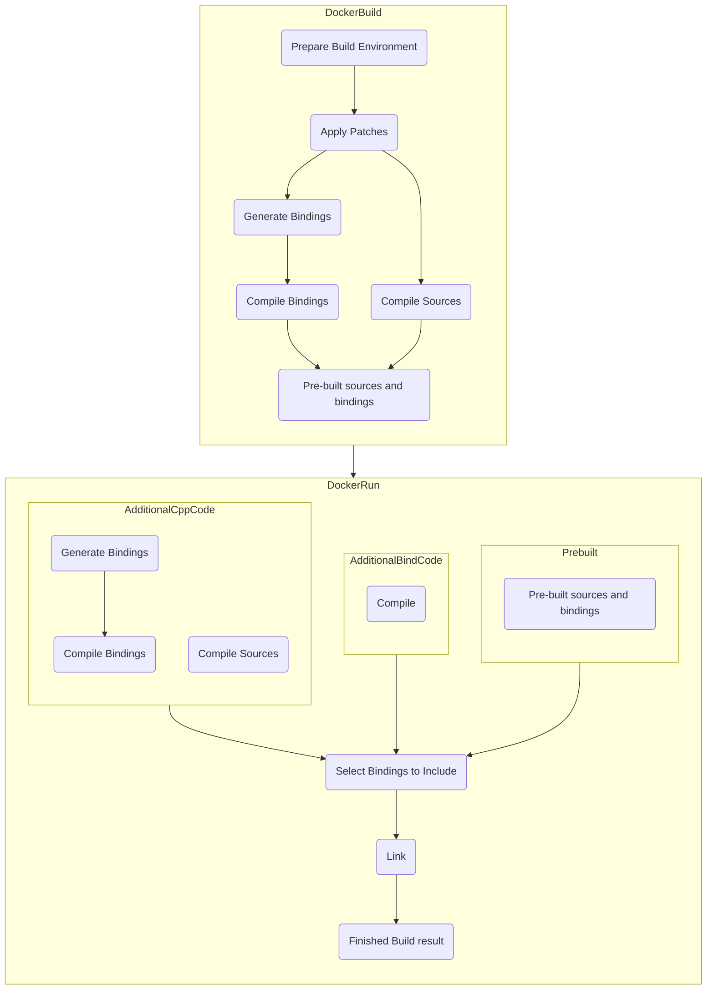

# Overview

The following flow-chart gives a broad overview of the steps performed by the build system.

```mermaid
flowchart TB
    subgraph DockerBuild
        direction TB
        DockerBuildA(Prepare Build Environment) --> DockerBuildB
        DockerBuildB(Apply Patches) --> DockerBuildC & DockerBuildE
        DockerBuildC(Generate Bindings) --> DockerBuildD
        DockerBuildD(Compile Bindings) --> DockerBuildF
        DockerBuildE(Compile Sources) --> DockerBuildF
        DockerBuildF(Pre-built sources and bindings)
    end
    subgraph DockerRun
        direction TB
        subgraph Prebuilt
            direction TB
            PrebuiltA(Pre-built sources and bindings)
        end
        subgraph AdditionalCppCode
            direction TB
            AdditionalCppCodeB(Generate Bindings) --> AdditionalCppCodeC
            AdditionalCppCodeC(Compile Bindings)
            AdditionalCppCodeD(Compile Sources)
        end
        subgraph AdditionalBindCode
            direction TB
            AdditionalBindCodeA(Compile)
        end
        AdditionalCppCode --> DockerRunA
        AdditionalBindCode --> DockerRunA
        Prebuilt --> DockerRunA
        DockerRunA(Select Bindings to Include) --> DockerRunB
        DockerRunB(Link) --> DockerRunC
        DockerRunC(Finished Build result)
    end
    DockerBuild --> DockerRun
```
